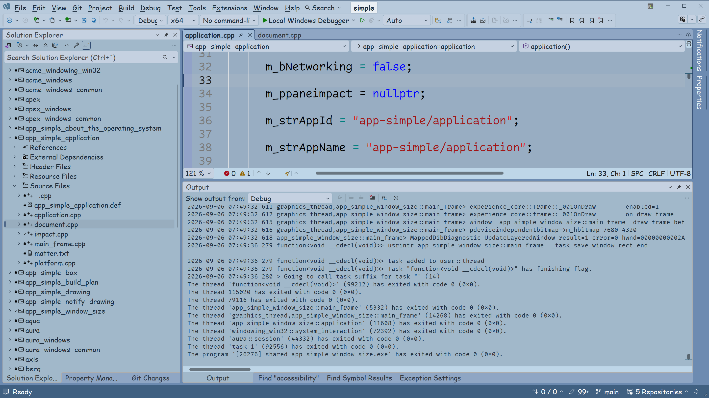

[marketplace]: <https://marketplace.visualstudio.com/items?itemName=ca2.bluevisualstudiotheme001>
[vsixgallery]: <http://vsixgallery.com/extension/ca2.ca2706e2-05d3-4da9-8754-652cd8ab65f4/>
[repo]:<https://github.com/ca2/blue_visual_studio_theme>

# blue - Theme for Visual Studio 2026

Download this extension from the [Visual Studio Marketplace][marketplace]
or get the [CI build][vsixgallery].

----------------------------------------

**Note!** This theme requires Visual Studio 2026

A blue light theme with blue grayed light code window.

## blue

## How can I help?

If you enjoy using the extension, please give it a ★★★★★ rating on the [Visual Studio Marketplace][marketplace].

Should you encounter bugs or if you have feature requests, head on over to the [GitHub repo][repo] to open an issue if one doesn't already exist.

Pull requests are also very welcome, since I can't always get around to fixing all bugs myself. This is a personal passion project, so my time is limited.

Another way to help out is to [sponsor me on GitHub](https://github.com/ca2/).
